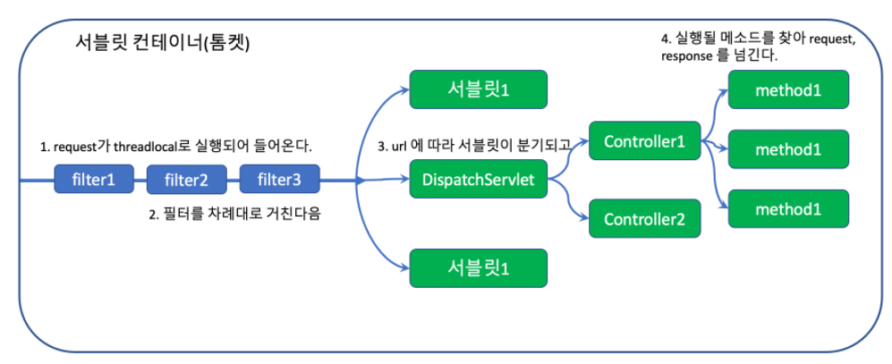
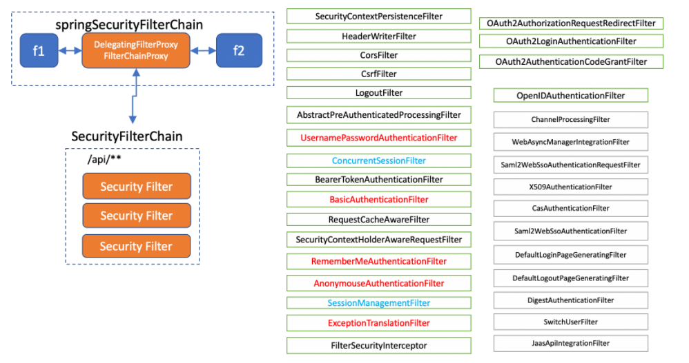
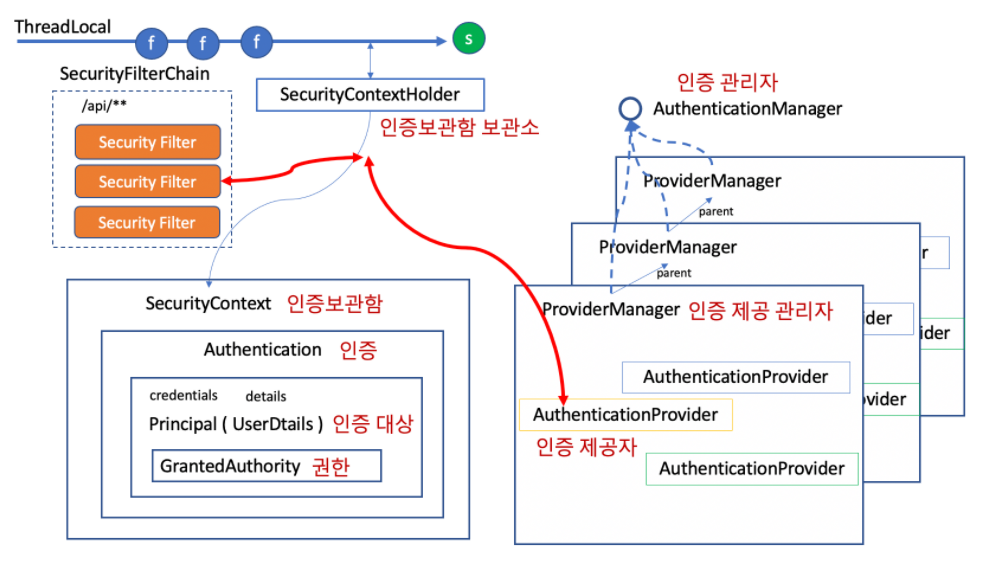
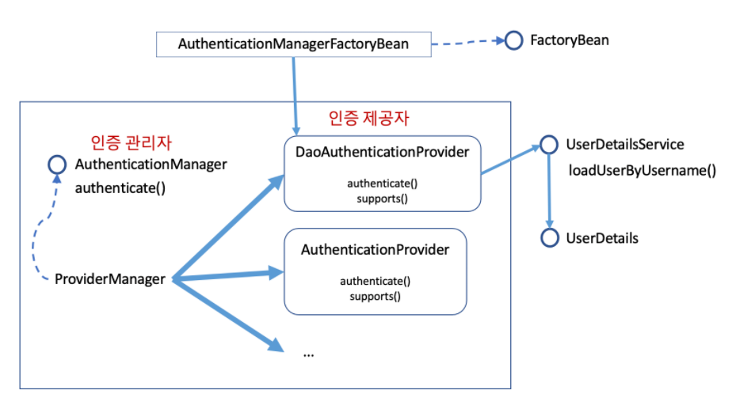

# spring-data-security
안정적인 서비스를 위한 Spring Data & Security

---
## 필요 개념
### Spring Security
* 스프링 기반의 어플리케이션 보안을 담당하는 프레임워크

### Servlet Container
* `Tomcat`과 같은 웹 애플리케이션을 서블릿 컨테이너
* 필터 체인 -> 모든 request는 반드시 거쳐야함



### Security Filters
* 스프링 시큐리티는 메인 필터 아래, `SecurityFilterChain` 그룹을 등록
* 필터 체인은 반드시 한개 이상, url 패턴에 따라 다르게 적용할 수 있음.



### Authentication Structure
* 로그인 -> `authenticated == true` 인 `Authentication` 객체를 `SecurityContext`에 갖고 있는 상태
* `AuthenticationManager`를 통해 `Authentication` 인증 -> `SecurityContextHolder`



### Basic Login
* `CSRF` : 사이트 간 요청 위조
  * `CsrfFilter` : 서버는 모든 요청에 토큰을 클라이언트에 전달, 클라이언트는 토큰을 HTTP Parameter 또는 헤더로 전달

* `WebSecurityConfiguerAdapter`를 상속받은 `config`에 `@EnableWebSecuriy` -> `SpringSecurityFilterChain`이 자동 포함
* `@EnableWebSecurity`
  * 웹 보안을 활성화
  * `WebSecurityConfigureAdapter`를 확장한 빈으로 설정되어야 유용.
```java
@EnableWebSecurity
public class SecurityConfig extends WebSecurityConfigureAdapter{
    
}
```

* `WebSecurityConfigureAdapter` 3가지 `Confiure()`
  * `configure(WebSecurity)` : 필터 연결 오바라이딩
  * `configure(HttpSecurity)` : 요청을 안전하게 보호하기 위한 설정
  * `configure(AuthenticationManagerBuilder)` : 사용자 세부 서비스 설정

* `@PreAuthorize` : `ROLE` 기반의 권한 처리
* `RoleHierarchy` : `role`에 계층 구도 설정
* `AuthenticationDetailsSource ` : `authentication`의 `details`를 커스터마이징

### Authentication Mechanism
* `Authentication` : 인증된 결과만 저장 x, 인증을 하기 위한 정보 + 인증을 받기 위한 정보
* `AuthenticationProvider` : 어떤 인증에 대해 허가를 내줄지 직접 보고
  * `support` : 처리 가능한 `Authentication` 알려줌
  * `authenticate()` : `Authentication` 입력값과 동시에 출력값
    * `Credentails` : 인증을 받기 위해 필요한 정보, 비번 등(input)
    * `Principal` : 인증된 결과, 대상(output)
    * `Details` : 기타 정보, 인증에 관여된 정보
    * `Authorities` : 구현 정보들


* `AuthenticationProvider` : 인증하고, 결과 리턴 -> `support` 메소드 지원
* `AuthenticationManager` : 인증 제공자들을 관리하는 인터페이스
  * `ProviderManager` : 인증 관리자를 구현한 객체
  
## 실행 오류
* [build.gradle - Could not find method compile()](https://devdavelee.tistory.com/29)
    * `compile` 대신 `implementation` 수정 후 reload
    * `Gradle` 3.0부터 의존 라이브러리 수정 시 재빌드가 필요한 라이브러리를 선택적으로 할 수 있도록 ~~compile~~